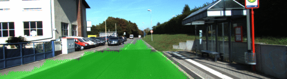

# Semantic Segmentation
### Introduction
In this project, we label the pixels of a road in images using a Fully Convolutional Network (FCN).

### Method
Use VGG-16 architecture to create a fully convolution neural network for semantic segmentation. Train with an Adam optimizer using a learning rate of 1e-4 for 40 epochs with a batch size of 16. No augmentation was performed. The loss decreased from ~0.6 after the first epoch to ~0.12 after all 40. Training was performed on CPU.

### Results
The network is able to label most of the road without labeling non-road. See below.

